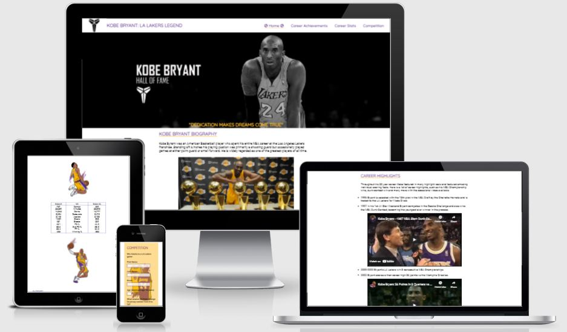
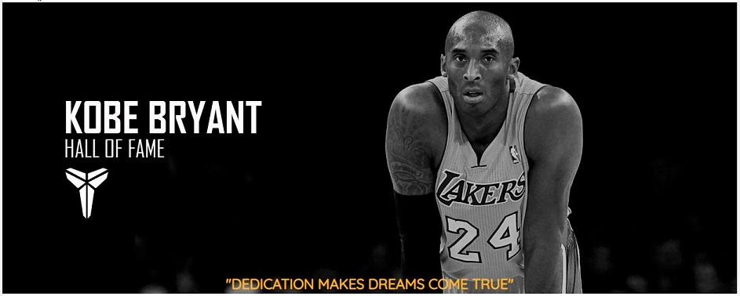
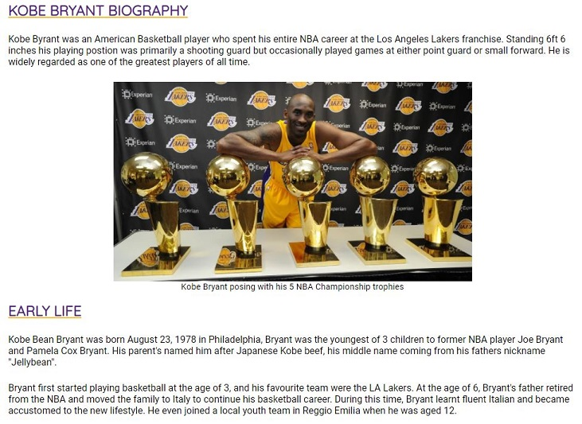
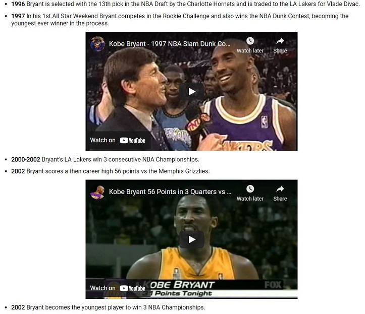
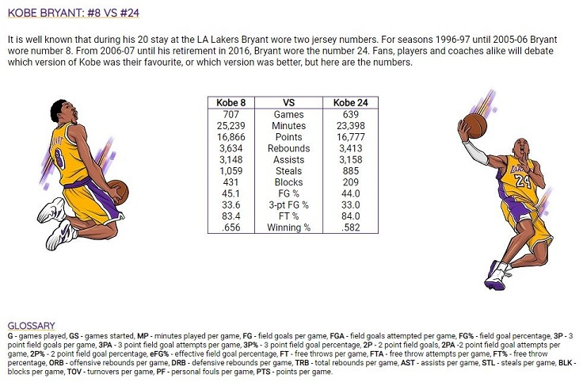
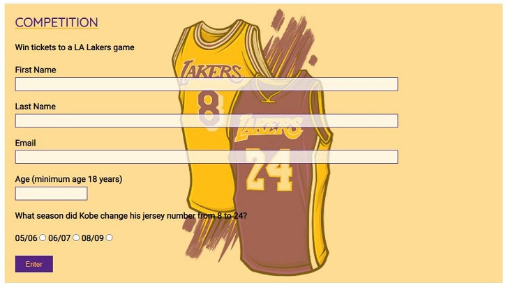
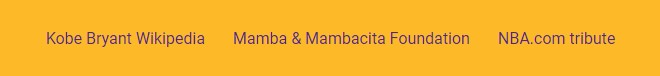

# **Kobe Bryant - LA Laker Legend**
## **Aim of the site**
The aim of my site is to give people a look into the career and also small look into the life of basketball legend Kobe Bryant. Kobe Bryant was an American Professional basketball player, who spent his entire 20 year career playing for the Los Angeles Lakers in the NBA. Bryant was one of few players to make the jump directly from high school direct to the NBA. His game was modelled on his idol Michael Jordan. By the end of his career, he was looked upon as his generation's Michael Jordan and his influence on younger generations is just as strong. The website is aimed at fans of Kobe, the LA Lakers basketball team, NBA fans or just people, such as younger, newer fans of the game looking to gain knowledge of Bryant and his career.

## **Features**

### **Colour Scheme**

When I decided on the colour scheme, I wanted to keep it simple but also represent the LA Laker colours. Bryant was a Lakers fan and spent his entire career there. The colours associated with the Lakers are purple (#552583) and yellow/gold (#FDB927). The navigaton bar links are purple, with the active page having a yellow underline. Navigation links also turn yellow when being hovered over. All headings have similar styling being purple with headings h2 to h4 also having a yellow underline.

### **Logo**

* The logo features Kobe Bryant's Black Mamba logo and the sites title - Kobe Bryant: LA Lakers Legend. I did consider using a different font for the title but decided to keep it consistent with the navigation menu but with larger text.
* Clicking either of these takes users back to the homepage.

### **Navigation Bar**

* The Navigation Bar is identical on all 4 pages to keep the appearance consistent and features links to the different pages on the website - home, career achievements, career stats and competition.
* The link for the active page features a visual aid so users can easily see what page they're currently on. This is achieved by underlining the link and a basketball icon on either side of the active page.
* Each link opens the correct page as intended.

### **Hero Image**

* The hero image features a picture of Bryant, his name Mamba logo and the letters HOF(Hall of Fame). Having the picture and name staright away gives users a visual aid to the content of the site.
* I've overlayed a Bryant quote on the hero image - "Dedication makes dreams come true". Bryant was known for his hard work in the gym during practice and would often be the first in and last out. This quote sums up his dedication to the sport.
* There are various @media queries to ensure the hero-image fits on screens of all sizes, tested down to 320px.

### **Home Page**

* The home page provides a small biography of Kobe Bryant allowing the user to learn more about his life and basketball career.
* Each section has a header detailing the contents of the section.
* Some sections have an image relevant to the content of that section to break up the paragraphs of text.

### **Career Achievements Page**

* This page has two sections. Career Achievments and Career Highlights
* This page looks at what Bryant achieved throughout his proffesional career such as his awards and championship wins.
* It uses a list structre to display his achievments so they can be read and understood easily.
* The career highlights section features a list which is date ordered. As this is in order, an ordered list could've been used but I felt the style of the unordered list was better suited.
* I added some videos of the highlighs to break up the list and give the users a view into some of these highpoints.

### **Career Statistics Page**

* This page features content showing Bryants career averages for both the in table format so the information is presented in a clear and readable
* It also  has a section that compares his career statistics whilst wearing his two jersey numbers; number 8 and number 24. This table has an image either side depicting the two stages of his career.
* At the bottom, there is a glossary to explain the abbrieviations used on the page.

### **Competiton Page**

* This page features a form for users to complete to enter a competition.
* The form consists of text, email and number input fields and three radio buttons.
* The input fields require the correct format to be entered, and the radio buttons require one to be selected before submission.
* The form keeps the colour theme going with yellow and purple featuring heavily and the background for the form has an image of Byrant's two jersey numbers.

### **Footer**

* The footer has some links to various external sites, Kobe Bryant's Wikipedia page, the Mamba & Mambacita Foundation created in memory of Braynt and his daughter Gianna and the NBA.com Kobe Bryant Tribute page.
* The colours used match the yellow and purple scheme used throughout the site.
* All links open a new browser tab and the html code has the appropriate aria-labels.

## **Testing**

To test cross-compatability I've tested the site using various browsers on desktop and Safari on Apple mobile devices:
* Chrome
* Chrome Dev
* Firefox 
* Microsoft Edge
* Safari

I have also tested the site across various devices.

* Windows 10 PC
* Windows Surface Pro 7
* Samsung A6 android tablet
* OnePlus 9 pro android phone
* Apple Ipad 7th Gen
* Apple Iphone 12

In addition I have used devtools to simulate various different screen sizes down to 320px.

In testing on all these browsers and devices I found the site worked as intended with one minor styling difference on Apple's Safari browser. The headers (h2-h4) in the main body content of the website have been styled to have a yellow underline, this was displayed on all browser apart from Safari. This however did not stop the rest of the website functioning as normal.

The form section on the competition page was tested to ensure that the required fields are entered, and in the correct format before the form is submitted.

### **Bugs and Fixes**

During development of the website I came across some bugs which I had to resolve.

1. **Intended Outcome** -  A Kobe Bryant quote to be displayed across the bottom of the Hero Image.
    * ***Issue Found***
        * On smaller devices the quote would drop off the bottom of the image as the hero image was shrinking smaller than expected on smaller devices
    * ***Solution***
        * The hero image was increased in size and the quote re-aligned to the new hero image size.

2. **Intended Outcome** - Three equal sized divs to be displayed across the width of the page in the Kobe-8-24 section on the career-stats page.
    * ***Issue Found***
        * Using margin '0 auto' on the centre div, the div on the right side would display below the left and centre divs.
    * ***Solution***
        * Used float left on centre div, whilst not ideal as the div isn't 100% central it allowed all three divs be displayed alongside each other.

3. **Itended Outcome** - On mobile devices, the youtube videos would shrink to fit the screen.
    *   ***Issue Found*** - 
        * On smaller devices, the career-achiements page the youtube videos overlapped the device resulting in some overflow.
    * ***Solution***
        * Used width 100% in css code to fit videos within the page margins.

### **Validator Testing**

**HTML**

I used the W3C validator found at https://validator.w3.org/ to test my HTML code. I came across one warning and two errors all of which have now been resolved.

* The warning was found in my Hero Image section. This was due to a lack of heading in the section. I had not yet chosen the heading I wanted to use with my Hero Image. I have now chosen and used a heading and this is no longer an issue.
* The first error I found was on the Career Achievements page. This was caused by the iframe element from the embedded Youtube videos being coded as child elements of the unorganised list. This was an error on my part as the iframe elements were meant to be included as part of the relevant li element for the list. Once this was done, the error was resolved
* The second error I encountered was also on the Career Achievments page. The embedded code for Youtube videos included the frameborder attribute which is now obsolete and css should be used for this instead. I have removed the frameborder attribute from the html code and added the relevant code to the css styling, this resolved the issue.

**CSS**

For CSS testing I used the Jigsaw validator found at https://jigsaw.w3.org/css-validator. There were no errors found when passing the code through.

### **Deployment**

The page was deployed on Github pages. The procedure followed was:
1. In the project's repository, go to the settings tab.
2. On the left hand menu select the pages tab.
3. In the source section, chose the Main branch from the drop-down menu and then press save.
4. The page will then display a message to indicate that the sit has been successfully deployed to GitHub pages and also provide the sites link.

The link for the deployed site is - [Kobe Bryant: LA Lakers Legend](https://anthonyjn08.github.io/Kobe-Bryant-LA-Lakers-Legend/index.html).

### **Credits**

#### **Content**

* The vast majority of the index.html content came from the [Kobe Bryant wiki](https://en.wikipedia.org/wiki/Kobe_Bryant) page, although as a fan of Kobe and basketball some of the content was recalled from my own knowledge.
* As with the index.html page, the vast majority of content from the career-achievements.html page came from the [Kobe Bryant wiki](https://en.wikipedia.org/wiki/Kobe_Bryant) page with some content from my own knowledge.
* The career-stats.html content for the regular season and playoffs came from [Basketball-Reference.com](https://www.basketball-reference.com/players/b/bryanko01.html) whilst the content for the Kobe Bryant: 8 vs 24 came from [ESPN](https://www.espn.com/espn/feature/story/_/id/29682794/kobe-bryant-two-legendary-nba-careers-no-8-no-24).
* The competition.html content is a question from my knowledge of Kobe Bryant, although reference to the change of jersey number change can also be found on the [Kobe Bryant wiki](https://en.wikipedia.org/wiki/Kobe_Bryant) page.
* The basketball icons in the navigation bar are taken from [Font Awesome](https://fontawesome.com/)
* The fonts used in the content for the page are imported from [Google Fonts](https://fonts.google.com/)

#### **Code**

* For one of my @media queries I used code from Code Institutes Love Running project. This is found on lines 327 to 338 in the style.css file and is commented above the code. Any code I would've written myself would be exactly the same.
* The rest of the code has been influenced by the Love Running project and also Coders Coffeehouse and may have some similarities but I have tried to deviate as much as possible from the code for these.

#### **Media**

**All Pages**

* Hero Image - the Hero image was taken from [basketballrevolution.es](https://www.basketrevolution.es/players/kobe-bryant?___store=english1)

**Index.html**

* The image in the Kobe Bryant Biography section was taken from [aminoapps.com](https://aminoapps.com/c/hoops/page/blog/3-ways-kobe-bryant-couldve-had-6-rings/N4RC_MuaNq53MPp28J8GPmeBboXW14x).
* The image in the Early Life section was taken from [cbsnews.com](https://www.google.co.uk/url?sa=i&url=https%3A%2F%2Fwww.cbsnews.com%2Fnews%2Fkobe-bryant-italy-reggio-emilia-joe-bryant-01-27-2020%2F&psig=AOvVaw1AMv2b4WdbzPGJRBdX5IVQ&ust=1638828765987000&source=images&cd=vfe&ved=0CAsQjRxqFwoTCLjJ0ZnXzfQCFQAAAAAdAAAAABAD).
* The image in the High School section was take from [inquirer.com](https://www.inquirer.com/sixers/kobe-bryant-high-school-basketball-coach-lower-merion-pennsylvania-20200320.html).
* The image in the Proffesional Career section was taken from [bleacherreport.com](https://bleacherreport.com/articles/2733163-kobe-bryant-lakers-jersey-retirement-statue).

**Competiton.html**

* All videos are embedded from youtube.com.

**Career-stats.html**

* The images in the Kobe Bryant: 8 vs 24 section were taken from [ESPN.com](https://www.espn.com/espn/feature/story/_/id/29682794/kobe-bryant-two-legendary-nba-careers-no-8-no-24).

**Competiton.html**

* The background image for the form is taken from [ESPN.com](https://www.espn.com/espn/feature/story/_/id/29682794/kobe-bryant-two-legendary-nba-careers-no-8-no-24).